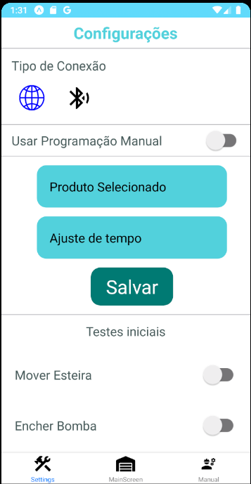
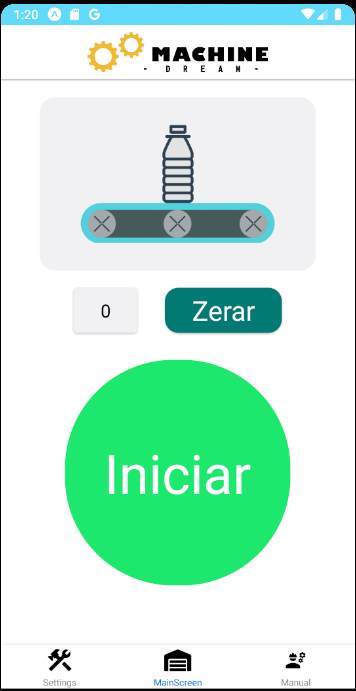

# Mobile-Project

<p align="left">
    
    
</p>

## Motivação
    Práticar os conhecimentos adquiridos sobre React Native
## Tecnologias

- Node.JS
- React
- React-Native
- Flask

## Instalação de depedências

```bash
npm install
npm start
```

```bash
yarn
yarn start
```
